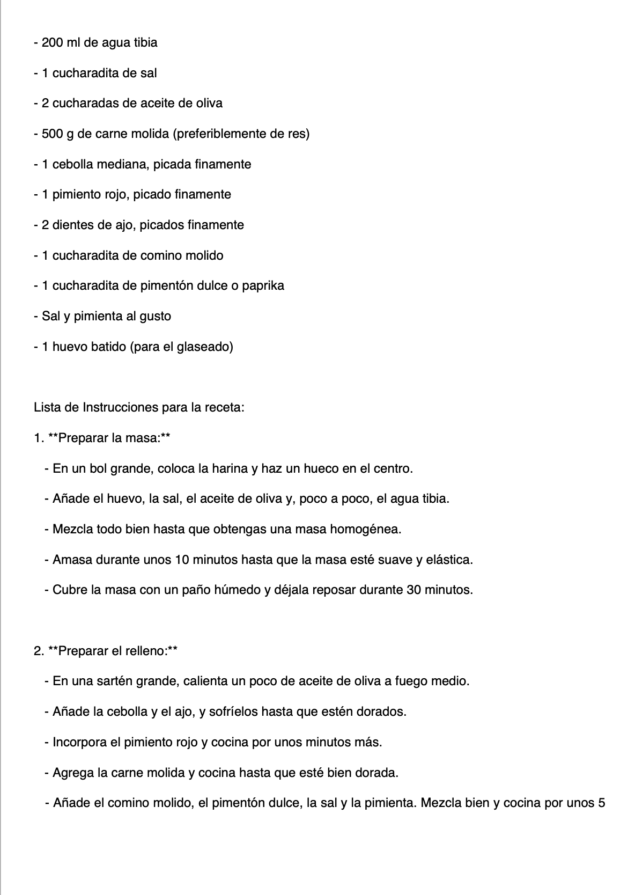
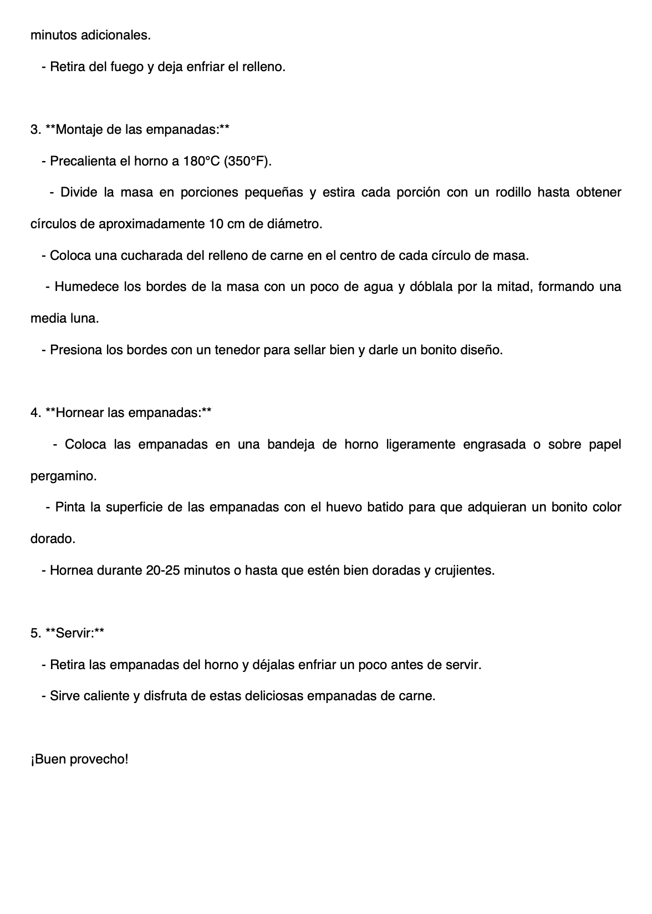
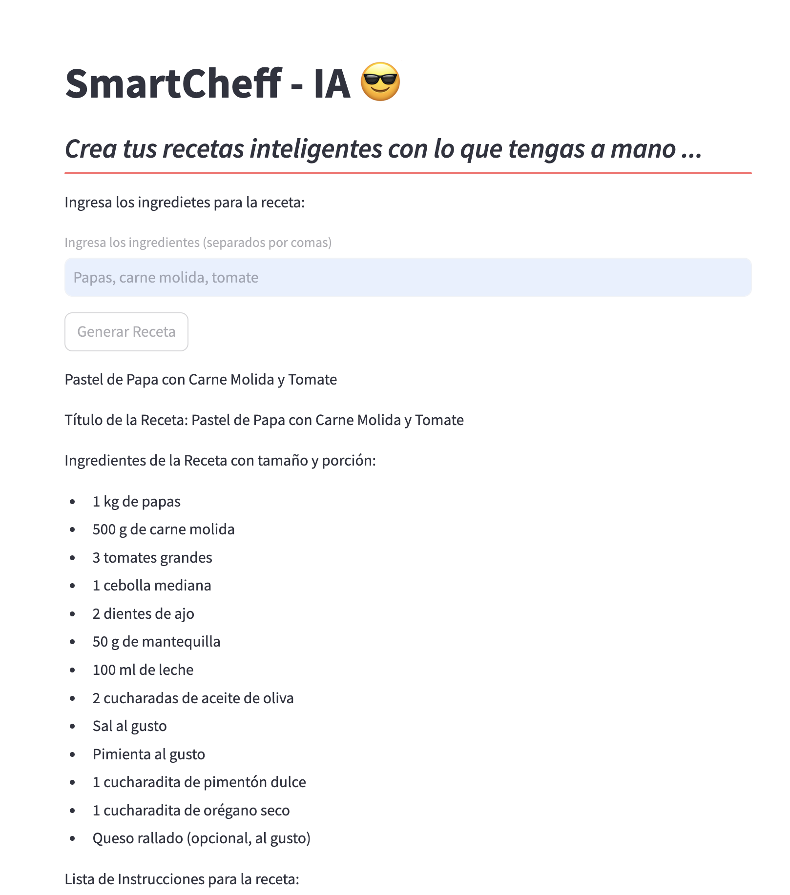
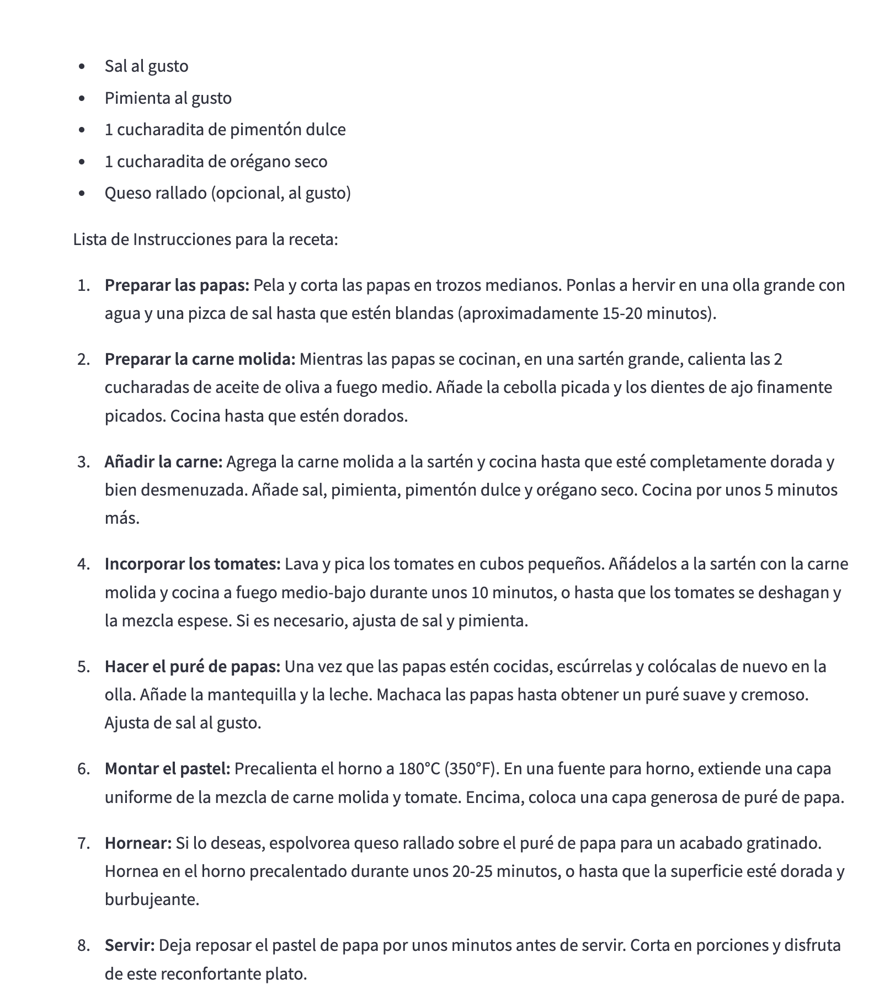
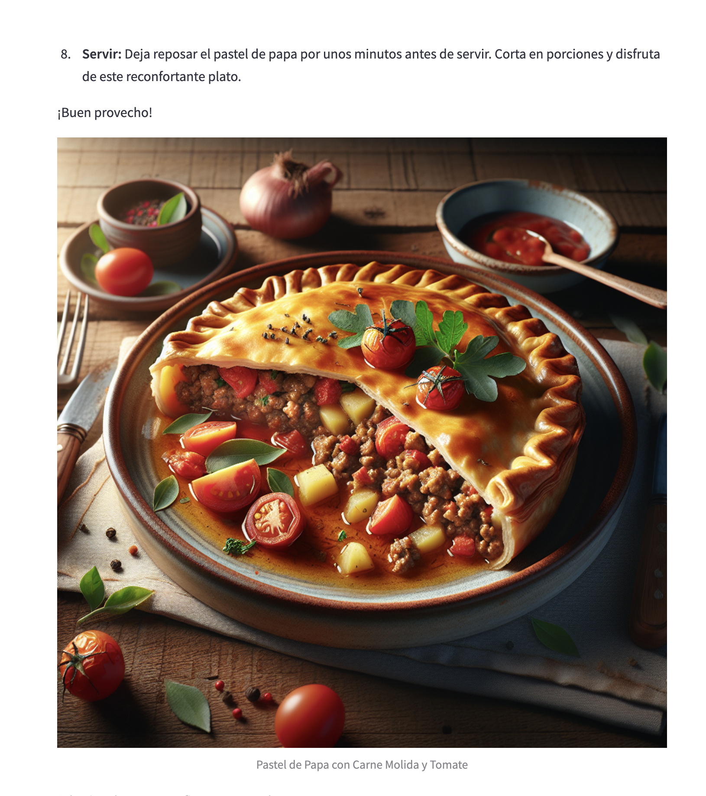
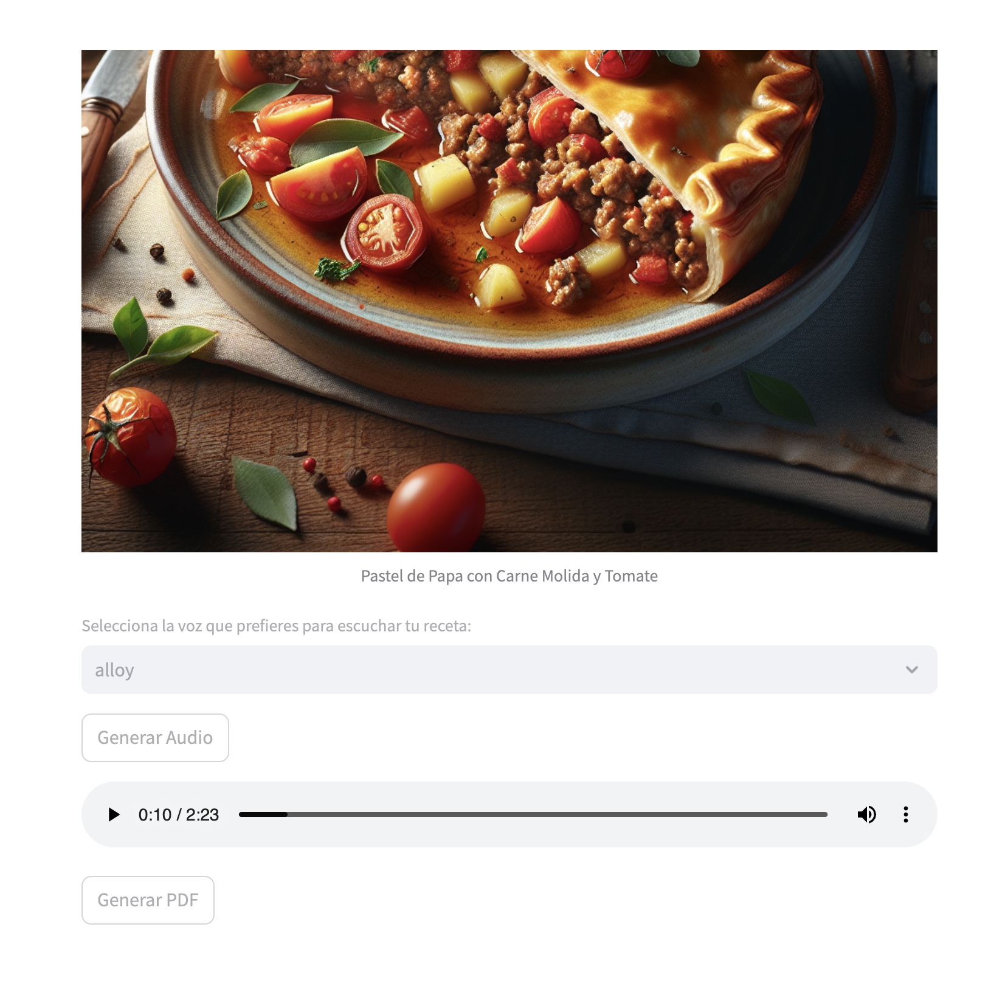

[![Status][statuss-shield]][statuss-url]
[![Forks][forks-shield]][forks-url]
[![Stargazers][stars-shield]][stars-url]
[![Issues][issues-shield]][issues-url]
[![MIT License][license-shield]][license-url]

<!-- PROJECT LOGO -->
<div align="center">
  <a href="https://github.com/hmfarias/SmartCheff">
    
  </a>
  <h2 align="center">Smart Cheff IA</h2>

  <p align="center">
    Generador de Recetas de Cocina Potenciado por IA
    <br />
    <a href="https://github.com/hmfarias/SmartCheff"><strong>Explora los documentos »</strong></a>
    <br />
    <br />
    <a href="https://github.com/hmfarias/SmartCheff">Ver repositorio</a>
    ·
    <a href="https://github.com/hmfarias/SmartCheff/issues">Reportar un error</a>
    ·
    <a href="https://github.com/hmfarias/SmartCheff/issues">Solicitar función</a>
  </p>
</div>

<!-- TABLE OF CONTENTS -->

<a name="top"></a>
### Tabla de contenidos

1. [Introducción](#introduccion)
2. [Archivos importantes de este repositorio](#archivos)
3. [Construido con](#consturido)
4. [Pre-requisitos](#prerequisitos)
5. [Ejecución del Archivo Jupyter Notebook](#ejecucion)
6. [APLICACIÓN CON FRONT END](#otroRepositorio)
7. [Contribuyendo](#contribuyendo)
8. [Licencia](#licencia)
9. [Contacto](#contacto)

<hr>

<!-- ABOUT THE PROJECT -->

<a name="introduccion"></a>
## INTRODUCCION

SmartCheff, es un sistema de inteligencia artificial innovador que permite crear recetas de cocina personalizadas a partir de una lista de ingredientes. Solo necesitas ingresar los ingredientes disponibles, y la IA se encargará de sugerir platos creativos que puedes preparar. Además, genera una imagen del plato final, brindándote una visualización clara de lo que puedes esperar al seguir la receta. Ideal para quienes buscan inspiración en la cocina o quieren aprovechar al máximo los ingredientes que tienen a mano. 

(Mayores detalles se brindan en los archivos incluídos en el repositorio ([Ver siguiente punto](#archivos))

[Volver al menú](#top)
<hr>

<a name="archivos"></a>
## ARCHIVOS IMPORTANTES

Entre los archivos de este repositorio, usted podrá encontrar dos que son los mas importantes:

1. **Archivo Jupyter Notebook** con el nombre **"Trabajo-Final-SmartCheff-IA.ipynb"**, el cual corresponde al proyecto final presentado.
(https://github.com/hmfarias/SmartCheff/blob/main/Trabajo-Final-SmartCheff-IA.ipynb)

2. **Archivo PDF** con el Trabajo Final que respalda al archivo anterior, con el nombre **"Trabajo final - Smart Cheff IA - Marcelo Farias.pdf"**
(https://github.com/hmfarias/SmartCheff/blob/main/Trabajo%20final%20-%20Smart%20Cheff%20IA%20-%20Marcelo%20Farias.pdf)

Ambos archivos presentan el mismo contenido con una explicación pormenorizada sobre el proyecto **Smart Cheff IA**, aunque el archivo Jupyter presenta el potencial de poder ejecutar la aplicación y observar el resultado.
Para poder hacerlo, resulta necesario que usted tenga a mano su API Key de OpenAI válida, la cual le será solicitada por **prompt cifrado** en el punto titulado **7-IMPLEMENTACIÓN - Paso 3 - Definición de API Key** del archivo Jupyter mencionado.

La siguiente imágen muestra un modelo de receta generado en el la ejecución del archivo Jupyter Notebook incluído en este repositorio.

<div align="center">
        
        
        
</div>

[Volver al menú](#top)
<hr>

<a name="consturido"></a>
### CONSTRUIDO CON

 como lenguaje de programación que cuenta con una amplia gama de librerías y frameworks que facilitan la interacción con APIs y el procesamiento de datos. Librerías como openai están bien documentadas y simplifican enormemente la implementación de solicitudes API.

 como entorno de desarrollo interactivo basado en la web que permite crear y compartir documentos que contienen código en vivo, visualizaciones y texto explicativo.

 como API proveedora de modelos de inteligencia artificial desarrollado por OpenAI. Cada modelo de OpenAI, puede considerarse como una funcionalidad o capacidad específica. Estos modelos son entrenados para realizar diversas tareas relacionadas con el procesamiento del lenguaje natural. Pueden llevar a cabo funciones como generación de texto, imágenes, traducción de idiomas, respuestas a preguntas, redacción de contenido, etc., todo basado en el contexto proporcionado durante su entrenamiento.

[Volver al menú](#top)
<hr>


<a name="prerequisitos"></a>
### PRE- REQUISITOS

Antes de comenzar deberá contar con:

- Instalacion funcional de Jupyter Notebook
- Python 3 o superior
- Pip (gestor de paquetes de Python)
- API Key de API openAI

  
[Volver al menú](#top)
<hr>


<a name="ejecucion"></a>
### EJECUCION DEL ARCHIVO JUPYTER NOTEBOOK
Para poder ejecutar el archivo Jupyter, usted deberá seguir los siguientes pasos:

1. ##### Clonar el proyecto del repositorio

- Cree una carpeta en un directorio local y desde la `terminal` dentro de la carpeta creada, inicialice git:

```
git init
```

- Clonar el repositorio

```
git clone https://github.com/hmfarias/SmartCheff.git
```
2. ##### Ejecutar Jupyter Notebook
```
jupyter notebook
```
- Dentro de Jupyter, navegar hasta el archivo **Trabajo-Final-SmartCheff-IA.ipynb** y ejecutarlo 

3. ##### Seguir el contenido del archivo


[Volver al menú](#top)
<hr>


<a name="otroRepositorio"></a>
### APLICACIÓN CON FRONT-END STREAMLIT 

Como complemento, se ha creado una aplicación que implementa lo visto en el archivo jupyter, e **incorpora la utilización del modelo OpenAI TTS-1 (Texto a Audio)**, asi como el uso de un front-end básico, generado mediante la libreria Streamlit.

Para descargar y utilizar esta aplicación, puede acceder a su repositorio en el siguiente link:
(https://github.com/hmfarias/SmartCheff-IA.git)

Las siguientes imágens muestran la pantalla front-end correspondiente a la aplicación que se puede encontrar en el repositorio mencionado.

<div align="center">
  
  
  
  
</div>

[Volver al menú](#top)
<hr>
    
<!-- CONTRIBUTING -->

<a name="contribuyendo"></a>
## CONTRIBUYENDO

Las contribuciones son lo que hace que la comunidad de código abierto sea un lugar increíble para aprender, inspirar y crear. Cualquier contribución que haga es **muy apreciada**.

Si tiene una sugerencia para mejorar este proyecto, por favor haga un "fork" al repositorio y cree un "pull request". También puede simplemente abrir un "issue" con la etiqueta "mejora".
¡No olvide darle una estrella al proyecto! ¡Gracias de nuevo!

1. Fork al Proyecto
2. Cree una nueva rama para su característica (`git checkout -b feature/newFeature`)
3. Commit para los cambios (`git commit -m 'Add some newFeature'`)
4. Push a la nueva rama (`git push origin feature/AmazingFeature`)
5. Abre un Pull Request

[Volver al menú](#top)
<hr>


<!-- LICENSE -->
<a name="licencia"></a>
## LICENCIA

Distribuido bajo la licencia MIT. Consulte `LICENSE.txt` para obtener más información.

[Volver al menú](#top)
<hr>


<!-- CONTACT -->

<a name="contacto"></a>
## CONTACTO

Marcelo Farias - [+54 9 3512601888] - hmfarias7@gmail.com


[Volver al menú](#top)
<hr>


<!-- ACKNOWLEDGMENTS -->

<!-- MARKDOWN LINKS & IMAGES -->

<!-- [statuss-shield]: https://img.shields.io/badge/STATUS-Developing-green -->

[statuss-shield]: https://img.shields.io/badge/STATUSS-finished-green
[statuss-url]: https://https://github.com/hmfarias/SmartCheff#readme
[forks-shield]: https://img.shields.io/github/forks/hmfarias/SmartCheff
[forks-url]: https://github.com/hmfarias/SmartCheff/network/members
[stars-shield]: https://img.shields.io/github/stars/hmfarias/SmartCheff
[stars-url]: https://github.com/hmfarias/SmartCheff/stargazers
[issues-shield]: https://img.shields.io/github/issues/hmfarias/SmartCheff
[issues-url]: https://github.com/hmfarias/SmartCheff/issues
[license-shield]: https://img.shields.io/github/license/othneildrew/Best-README-Template.svg
[license-url]: https://github.com/hmfarias/SmartCheff/blob/master/LICENSE.txt
[product-screenshot]: https://github.com/hmfarias/SmartCheff/blob/main/assets/images/screenShot.webp
[product-screenshot-navbar]: https://github.com/hmfarias/SmartCheff/blob/main/assets/images/navbar.webp
[others-url]: https://github.com/hmfarias/SmartCheff


